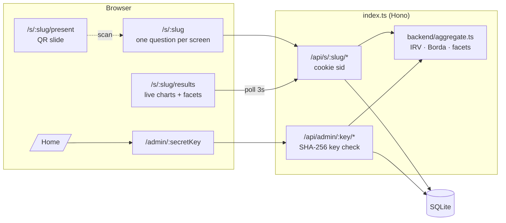

# 📊 Audience Survey

Live polling for talks. Show a QR code, let the room answer on their phones with **no login**, then reveal results on the projector — with ranked-choice runoffs, word clouds, and breakdowns by who's in the audience.

**[Create a survey](url:index.ts)** · no account needed

## How a talk goes

1. **Create** — hit the homepage, name your survey. You get a **secret admin link** (bookmark it — it's the only way back).
2. **Build** — add questions. Mark ones like *"What's your profession?"* as **Demographic** so you can group everything else by them later.
3. **Share** — put the fullscreen **join slide** (`/s/<slug>/present`) on the projector. It shows a big QR code + short URL.
4. **Collect** — the audience answers one question per screen. Each phone gets a cookie so answers are one-per-device and editable; no accounts.
5. **Reveal** — flip **Show results to audience**. Open `/s/<slug>/results` on the projector; it live-updates every 3s. Use **Group by** to split every chart by a demographic question, or click a group chip to isolate it.

## Question types

| Type | Respondent sees | Results visualization |
| --- | --- | --- |
| Multiple choice (one / many) | Tappable cards | Colored bar chart; grouped bars when faceted |
| Scale / rating (e.g. 1–5, 0–10 NPS) | Number grid | Heat-colored histogram + animated mean |
| **Ranked choice** | Tap-to-rank list with reorder | **Instant-runoff animation** — step through elimination rounds, or switch to Borda points / first choices. Per-group winners when faceted |
| Word cloud | Single word/phrase | Sized, tilted word cloud |
| Free text | Textarea | Sticky-note wall |
| Emoji reaction | Emoji grid | Floating emoji bubbles scaled by count |

## Admin controls

- **Accepting responses** — close the survey when you move on
- **Show results to audience** — survey-wide reveal toggle
- **Hide results** (per question) — keeps a question out of the audience view even when results are on
- **Audience can group results** — let respondents use the facet controls too (off by default, keeps the projector clean)
- **Focus one question** — projector-sized single-question view for pacing a talk
- CSV export, clear responses, delete survey

## Architecture



**Security model:** the admin key is a 28-char random token stored only as a SHA-256 hash. Respondents are identified by an `HttpOnly` cookie; clearing it or switching devices allows a second response (acceptable trade-off for a login-free live poll — a "welcome back" banner nudges returning devices to edit instead).

## Files

```
index.ts                       Hono server: shell routes, public + admin API, QR SVG
backend/db.ts                  SQLite schema, hashing, random ids
backend/surveys.ts             CRUD, response upsert, answer sanitization
backend/aggregate.ts           per-type aggregation, instant-runoff, facet bucketing
shared/types.ts                Question/answer/result types shared by client & server
frontend/
  root.tsx                     HTML shell
  index.tsx                    React mount
  lib/api.ts                   typed fetch helpers
  components/App.tsx           path router
  pages/Home.tsx               create a survey
  pages/Admin.tsx              build · share · results tabs
  pages/Respond.tsx            one-question-per-screen flow
  pages/Results.tsx            public live results
  pages/Present.tsx            fullscreen QR join slide
  components/builder/          QuestionEditor
  components/respond/          QuestionInput (all types, ranked drag/tap)
  components/charts/           Charts (recharts + custom), ResultsView (polling, facets)
```
