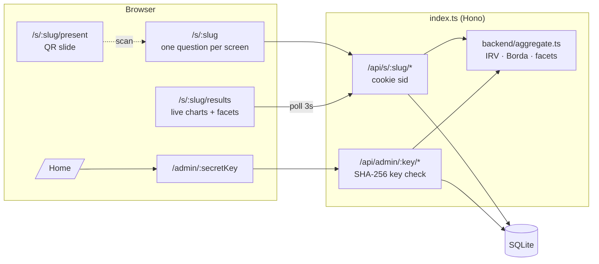

# 📊 Audience Survey

Live polling for talks. Show a QR code, let the room answer on their phones with **no login**, then reveal results on the projector — with ranked-choice runoffs, word clouds, and breakdowns by who's in the audience.

**[Create a survey](url:index.ts)** · no account needed

## How a talk goes

1. **Create** — hit the homepage, name your survey. You get a **secret admin link** (bookmark it — it's the only way back).
2. **Build** — add questions. Mark ones like *"What's your profession?"* as **Demographic** so you can group everything else by them later.
3. **Share** — put the fullscreen **join slide** (`/s/<slug>/present`) on the projector. It shows a big QR code + short URL.
4. **Collect** — the audience answers one question per screen. Each phone gets a cookie so answers are one-per-device and editable; no accounts.
5. **Reveal** — flip **Show results to audience**. Open `/s/<slug>/results` on the projector; it live-updates every 3s. Use **Group by** to split every chart by a demographic question, or click a group chip to isolate it.
6. **Co-create** — participants suggest complete questions and upvote others from the intro or thank-you screen. In the admin **Proposals** tab, review a draft, edit it, then approve it to append a live question. Finished participants see an invitation to answer newly added questions rather than being moved away from the community queue.

## Community questions

Participants can propose any supported question type, including options or scale bounds. Pending proposals are public, sorted by upvotes (oldest first on ties), and refresh every 5 seconds while the page is visible. Each device can toggle one upvote per proposal; submitting a proposal does not automatically vote for it. Proposals do not require answering the survey first, and participants may upvote their own ideas.

The presenter sets required, demographic, and result-visibility flags during review. Approval is manual regardless of vote count, immediately appends the edited question, and removes its proposal from the pending queue. Votes are not survey answers. There are no comments, participant edits, rejection actions, or automatic approvals.

Closing **Accepting responses** also closes proposals and voting, but leaves pending ideas readable. Admins may still approve while closed; participants can answer those questions when the survey reopens. Clearing responses keeps proposals and votes; deleting the survey removes them.

Proposal prompts are limited to 500 characters. Choice questions require 2–20 distinct nonempty options of up to 120 characters each. Scales use integer bounds between -100 and 100 and contain 2–21 steps. Submission and approval requests are limited to 16 KB.

## Question types

| Type | Respondent sees | Results visualization |
| --- | --- | --- |
| Multiple choice (one / many) | Tappable cards | Colored bar chart; grouped bars when faceted |
| Scale / rating (e.g. 1–5, 0–10 NPS) | Number grid | Heat-colored histogram + animated mean |
| **Ranked choice** | Tap-to-rank list with reorder | **Instant-runoff animation** — step through elimination rounds, or switch to Borda points / first choices. Per-group winners when faceted |
| Word cloud | Single word/phrase | Sized, tilted word cloud |
| Free text | Textarea | Sticky-note wall |
| Emoji reaction | Emoji grid | Floating emoji bubbles scaled by count |

## Admin controls

- **Accepting responses** — close the survey when you move on
- **Show results to audience** — survey-wide reveal toggle
- **Hide results** (per question) — keeps a question out of the audience view even when results are on
- **Audience can group results** — let respondents use the facet controls too (off by default, keeps the projector clean)
- **Focus one question** — projector-sized single-question view for pacing a talk
- **Proposals** — review the audience's most-upvoted question drafts, edit, and approve
- CSV export, clear responses, delete survey

## Architecture



**Security model:** the admin key is a 28-char random token stored only as a SHA-256 hash. Respondents are identified by an `HttpOnly` cookie; clearing it or switching devices allows a second response or another proposal vote (acceptable trade-off for a login-free live poll — a "welcome back" banner nudges returning devices to edit instead). Public proposal payloads never expose device identifiers. Votes are unique per device and proposal, not per verified person; this is not strong abuse prevention.

Approval claims the pending proposal and appends its question in a single SQLite write transaction. Question-builder saves compare their last saved question snapshot to prevent stale tabs from overwriting an approval; conflicts retain local edits and offer a reload rather than silently losing questions.

## Files

```
index.ts                       Hono server: shell routes, public + admin API, QR SVG
backend/db.ts                  SQLite schema, hashing, random ids
backend/surveys.ts             CRUD, response upsert, answer sanitization
backend/aggregate.ts           per-type aggregation, instant-runoff, facet bucketing
backend/proposals.ts           proposal normalization, queries, approval workflow
backend/proposal-sql.ts        proposal/vote schema and atomic mutation statements
backend/errors.ts              expected API error types
shared/types.ts                Question/answer/result types shared by client & server
shared/questions.ts            shared question defaults and proposal validation
frontend/
  root.tsx                     HTML shell
  index.tsx                    React mount
  lib/api.ts                   typed fetch helpers
  lib/useProposals.ts          abortable live proposal polling
  components/App.tsx           path router
  pages/Home.tsx               create a survey
  pages/Admin.tsx              build · share · results tabs
  pages/Respond.tsx            one-question-per-screen flow
  pages/Results.tsx            public live results
  pages/Present.tsx            fullscreen QR join slide
  components/builder/          QuestionEditor
  components/proposals/        participant composer, proposal cards, admin review
  components/respond/          QuestionInput (all types, ranked drag/tap)
  components/charts/           Charts (recharts + custom), ResultsView (polling, facets)
```

## Proposal regression tests

The tests use Deno's built-in runner and real in-memory SQLite through `node:sqlite`; the test configuration redirects only the Val Town SQLite import. No live survey data is used. The placeholder environment value lets the existing Val Town asset utility initialize without real credentials.

```sh
VAL_TOWN_API_KEY=local-test-placeholder deno test --allow-import --allow-env=VAL_TOWN_API_KEY \
  --config tests/deno.json tests/api_test.ts shared/questions_test.ts backend/proposal-sql_test.ts
```
